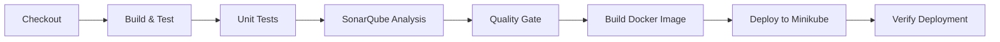

# 🚀 Quick Start - CI/CD con Jenkins y SonarQube en Minikube

## ✅ Estado del Sistema

### Servicios Desplegados

| Servicio | URL | Estado |
|----------|-----|--------|
| **Jenkins** | http://192.168.49.2:30800 | ✅ Running |
| **SonarQube** | http://192.168.49.2:30900 | ✅ Running |
| **PostgreSQL** | Internal (sonarqube-postgresql:5432) | ✅ Running |

### Credenciales

**Jenkins**:
```
URL: http://192.168.49.2:30800
Usuario: admin
Contraseña: 0cIluLpqXNK15U3UwV22F6
```

**SonarQube**:
```
URL: http://192.168.49.2:30900
Usuario: admin
Contraseña: admin (cambiar en primer login)
```

---

## 🏃 Inicio Rápido (3 pasos)

### 1️⃣ Configurar SonarQube (5 minutos)

```bash
# 1. Abrir SonarQube
xdg-open http://192.168.49.2:30900

# 2. Login con admin/admin
# 3. Cambiar contraseña cuando se solicite
# 4. Crear token:
#    My Account → Security → Generate Tokens
#    Name: jenkins-integration
#    Type: Global Analysis Token
#    Expiration: No expiration
#    Generate
# 5. COPIAR EL TOKEN (importante!)
```

### 2️⃣ Configurar Jenkins (5 minutos)

```bash
# 1. Abrir Jenkins
xdg-open http://192.168.49.2:30800

# 2. Login con admin/0cIluLpqXNK15U3UwV22F6
# 3. Agregar token de SonarQube:
#    Manage Jenkins → Credentials
#    (global) → Add Credentials
#    Kind: Secret text
#    Secret: [PEGAR TOKEN DE SONARQUBE]
#    ID: sonarqube-token
#    Description: SonarQube Token
#    Create
```

### 3️⃣ Crear y Ejecutar Pipeline (2 minutos)

```bash
# 1. En Jenkins: New Item
#    Name: ecommerce-pipeline
#    Type: Pipeline
#    OK

# 2. En Configuration → Pipeline:
#    Definition: Pipeline script from SCM
#    SCM: Git
#    Repository URL: [TU REPO]
#    Branch Specifier: */master
#    Script Path: Jenkinsfile
#    Save

# 3. Build with Parameters:
#    SERVICE_NAME: user-service
#    RUN_SONAR: true
#    DEPLOY_TO_MINIKUBE: true
#    Build
```

---

## 📋 Archivos Creados

```
ecommerce-microservice-backend-app/
├── Jenkinsfile                      # Pipeline principal
├── CICD_SETUP.md                    # Documentación completa
├── JENKINS_PIPELINE_GUIDE.md        # Guía detallada del pipeline
├── jenkins-values.yaml              # Configuración de Jenkins
├── sonarqube-values.yaml            # Configuración de SonarQube
└── k8s-cicd/
    └── jenkins-rbac.yaml            # Permisos RBAC para Jenkins
```

---

## 🎯 Flujo del Pipeline



### Duración Estimada
- **Build completo**: ~5-7 minutos
- **Solo build (sin SonarQube)**: ~3-4 minutos
- **Hotfix (sin tests ni análisis)**: ~2 minutos

---

## 🔍 Comandos de Verificación

```bash
# Ver todos los pods de CI/CD
kubectl get pods -n cicd

# Ver logs de Jenkins
kubectl logs -f jenkins-0 -c jenkins -n cicd

# Ver logs de SonarQube
kubectl logs -f sonarqube-sonarqube-0 -n cicd

# Ver services expuestos
kubectl get svc -n cicd

# Ver permisos de Jenkins
kubectl auth can-i create deployments \
  --as=system:serviceaccount:cicd:jenkins \
  -n ecommerce
```

---

## 🚀 Desplegar tus Microservicios

Una vez configurado el pipeline, despliega tus microservicios:

```bash
# 1. Crear namespace (si no existe)
kubectl create namespace ecommerce

# 2. Desplegar servicios con tus manifiestos YAML
kubectl apply -f k8s-minikube/ -n ecommerce

# 3. Verificar
kubectl get pods -n ecommerce
```

---

## 🎓 Casos de Uso

### Desarrollo Diario

**Flujo típico**:
1. Hacer cambios en código
2. Commit y push
3. Ejecutar pipeline en Jenkins
4. Revisar resultados en SonarQube
5. Verificar deployment en Minikube

### Code Review

**Antes de merge**:
```bash
# Ejecutar pipeline con análisis completo
SERVICE_NAME: [servicio-modificado]
RUN_SONAR: true
DEPLOY_TO_MINIKUBE: false
```

**Revisar en SonarQube**:
- Cobertura de tests
- Code smells
- Bugs detectados
- Vulnerabilidades

### Hotfix Urgente

**Deploy rápido**:
```bash
SERVICE_NAME: [servicio-a-parchear]
RUN_SONAR: false
DEPLOY_TO_MINIKUBE: true
```

---

## 📊 Métricas y Monitoreo

### SonarQube Metrics

**Acceder a**: http://192.168.49.2:30900

**Métricas clave**:
- **Reliability**: Bugs
- **Security**: Vulnerabilities
- **Maintainability**: Code Smells
- **Coverage**: % de código testeado
- **Duplications**: Código duplicado

### Jenkins Metrics

**Acceder a**: http://192.168.49.2:30800/job/ecommerce-pipeline/

**Métricas clave**:
- Build success rate
- Average build time
- Test pass rate
- Last success/failure

---

## 🐛 Solución Rápida de Problemas

### Jenkins no se conecta a SonarQube

```bash
# Verificar que SonarQube esté accesible desde Jenkins
kubectl exec -it jenkins-0 -n cicd -c jenkins -- \
  curl -v http://sonarqube-sonarqube:9000

# Debería responder con código 200
```

### Pipeline falla al crear pods

```bash
# Verificar RBAC
kubectl get serviceaccount jenkins -n cicd
kubectl get clusterrolebinding jenkins-deploy

# Si falta, aplicar de nuevo
kubectl apply -f k8s-cicd/jenkins-rbac.yaml
```

### Docker daemon no accesible

```bash
# Verificar socket de Docker en Minikube
minikube ssh "ls -la /var/run/docker.sock"

# Debería mostrar: srw-rw---- 1 root docker ...
```

### SonarQube muy lento

```bash
# Aumentar recursos
helm upgrade sonarqube sonarqube/sonarqube -n cicd \
  --set resources.requests.memory=3Gi \
  --set resources.limits.memory=6Gi
```

---

## 🎯 Próximos Pasos

1. ✅ **Configurar Webhooks** para builds automáticos
2. ✅ **Configurar Quality Gates** en SonarQube
3. ✅ **Agregar tests de integración** al pipeline
4. ✅ **Configurar notificaciones** (Slack, Email)
5. ✅ **Implementar rollback automático** en caso de fallo
6. ✅ **Agregar escaneo de seguridad** (OWASP Dependency Check)

---

## 📚 Documentación Adicional

- **CICD_SETUP.md**: Configuración detallada
- **JENKINS_PIPELINE_GUIDE.md**: Guía completa del pipeline
- **Jenkinsfile**: Pipeline comentado con todas las etapas

---

## 🎉 ¡Todo Listo!

Tu entorno CI/CD está completamente configurado y listo para usar.

**Siguiente paso**:
1. Abrir Jenkins: http://192.168.49.2:30800
2. Crear tu primer pipeline job
3. Ejecutar un build de prueba

¡Feliz CI/CD! 🚀
